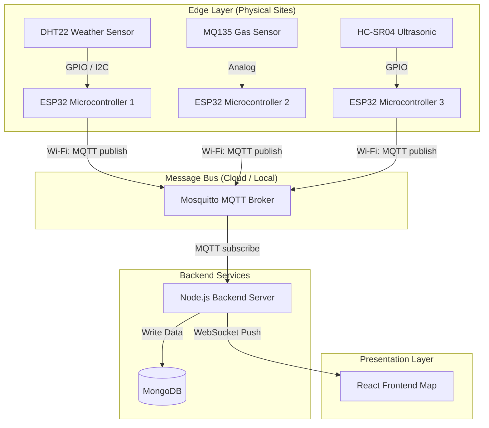
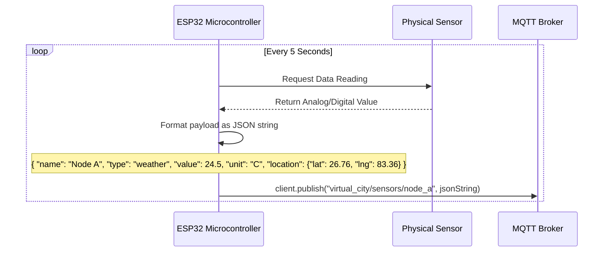

# Digital Twin Hardware Architecture

This document provides a comprehensive overview of how to integrate real-world physical hardware into the Digital Twin project. It covers our overall approach, the system architecture, specific sensors used, and installation guides.

---

## 🏗️ 1. Architecture ও Approach

Our approach relies on **Edge Computing** and an **Event-Driven Architecture (MQTT)**. By decoupling the hardware from the frontend, the React Dashboard doesn't need to know if the data is coming from a Python simulator or a real ESP32 microprocessor. 

All sensors act as **Edge Nodes**. They read physical environment data, connect to a local Wi-Fi network, and publish small, lightweight JSON payloads to a central Message Broker (Mosquitto). The Node.js Server subscribes to this broker, ingests the data, saves it to the database, and broadcasts it to the frontend map via WebSockets.

### High-Level Hardware Architecture

---

## 🔌 2. Core Hardware Components

### The Microcontroller: **ESP32 NodeMCU**
The brain of every Edge Node is the ESP32. It reads voltage/digital signals from the sensors and transmits the data over Wi-Fi. It is incredibly cheap, highly reliable, and supports the Arduino IDE.

### Recommended Sensors

#### 1. DHT22 (Weather / Climate)
* **Purpose**: Measures Temperature & Humidity.
* **Usage**: Used to monitor urban heat islands or general weather at specific city coordinates.
* **Output**: Digital signal (One-Wire).

#### 2. MQ-135 / PMS5003 (Air Quality & Pollution)
* **Purpose**: Detects harmful gases (Ammonia, Benzene, CO2) and particulate matter.
* **Usage**: Tracks pollution hotspots around the city.
* **Output**: Analog voltage (higher voltage = higher pollution).

#### 3. HC-SR04 (Traffic & Proximity)
* **Purpose**: Emits ultrasonic sound waves to measure distance.
* **Usage**: Pointed at a road or parking lot. A sudden drop in distance indicates a car has passed by. The ESP32 counts these events over a minute to calculate `cars/min`.
* **Output**: Digital timing pulse.

---

## 🛠️ 3. Installation & Integration Guide

### Step 1: Wiring
1. **Power**: Connect the sensor's `VCC` pin to the ESP32's `3V3` or `VIN` (5V) pin (depending on the sensor's requirement).
2. **Ground**: Connect the sensor's `GND` pin to the ESP32's `GND`.
3. **Signal**: Connect the sensor's `DATA` / `OUT` pin to an available GPIO pin on the ESP32 (e.g., `GPIO 4`).

### Step 2: C++ Code logic (Arduino IDE)
Your ESP32 needs to be programmed to handle the connection to Wi-Fi, the connection to MQTT, and the Sensor reading logic. 

Here is the flowchart of what the microcontroller C++ code should do inside its `loop()`:

### Step 3: Hardware Placement & Location Tagging
Because sensors are physical objects, they need a GPS location to appear on the Virtual City map.

1. **Static Installation**: If you mount the DHT22 to a street pole, go to Google Maps, find that exact pole, right-click to copy the Latitude/Longitude, and **hardcode** those coordinates into the JSON string the ESP32 generates.
2. **Dynamic Installation**: If the sensor is mounted to a moving bus, you must add a GPS module (like the `NEO-6M`) to the ESP32. The ESP32 will then read the live coordinates every second and dynamically rebuild the JSON string before publishing to MQTT.

### Step 4: Verification
Once the ESP32 is powered on (via a battery bank or wall adapter), watch the Node.js backend console. You should instantly see:
`[MQTT] Received message on topic virtual_city/sensors/node_a`
The new physical sensor will appear immediately on the React map!
